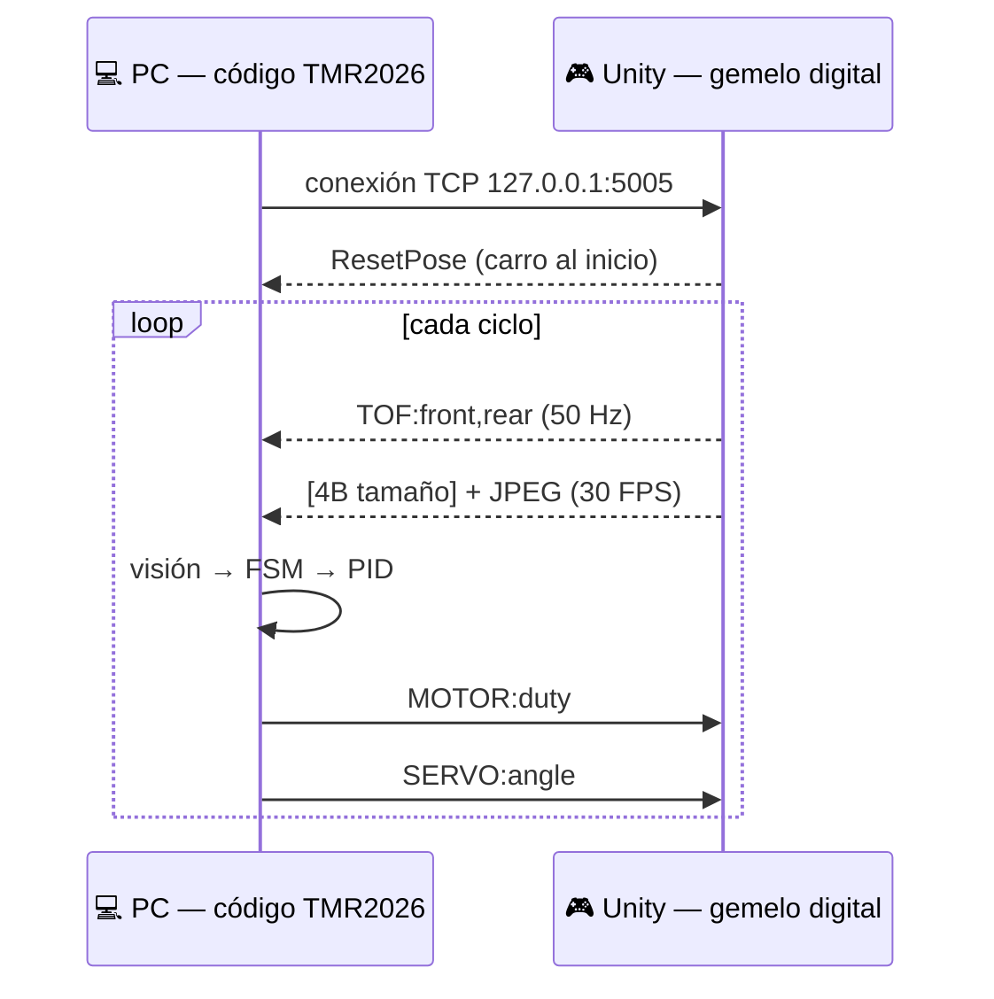
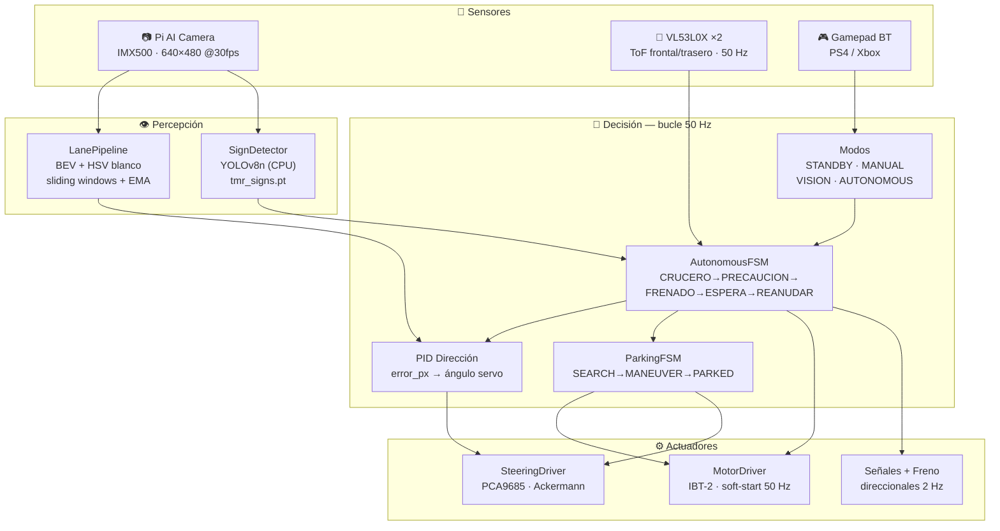
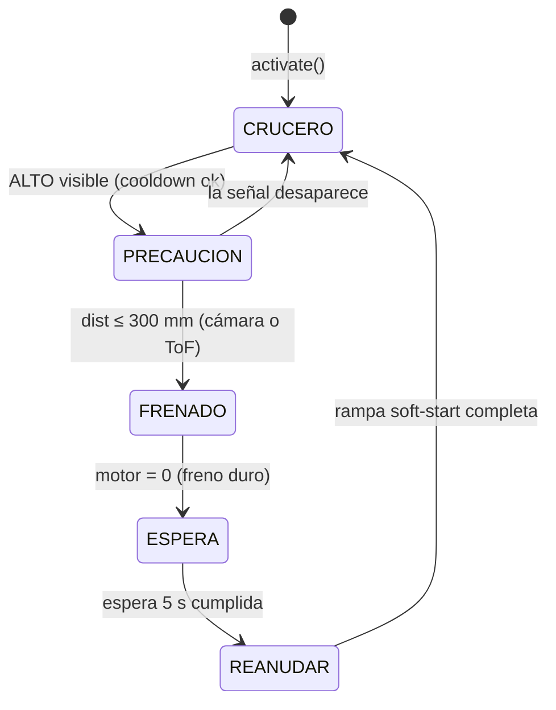
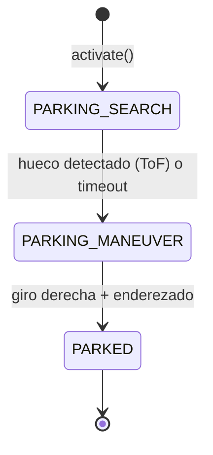
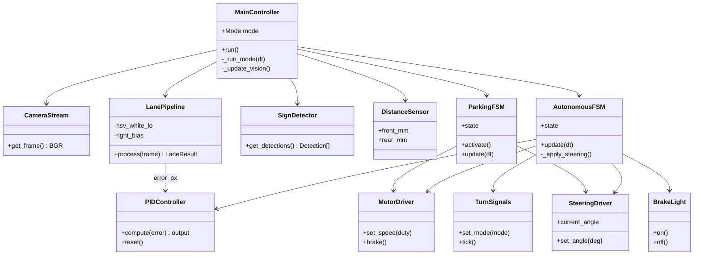

<div align="center">

# 🏎️ Carrito Autónomo — TMR 2026

**Vehículo autónomo a escala 1:10 para el Torneo Mexicano de Robótica 2026.**
Seguimiento de carril por visión, frenado ante señal de **ALTO**, máquina de estados de conducción
y **estacionamiento en batería** — sobre Raspberry Pi 5 con cámara Sony IMX500.

Validado con un **gemelo digital en Unity** (Sim2Real) antes de tocar el hardware.

[](https://python.org)
[](https://raspberrypi.com)
[](https://opencv.org)
[](https://ultralytics.com)
[](https://github.com/Empanaditasesina72/TMR2026_Sim-2026-05-24_20-19-01)
[](#-validación-sim2real-gemelo-digital)

</div>

---

## 📑 Tabla de contenido

- [¿Qué es?](#-qué-es)
- [Validación Sim2Real (gemelo digital)](#-validación-sim2real-gemelo-digital)
- [Arquitectura del sistema](#-arquitectura-del-sistema)
- [Máquina de estados](#-máquina-de-estados)
- [Diagrama de clases (UML)](#-diagrama-de-clases-uml)
- [Pipeline de visión](#-pipeline-de-visión)
- [Hardware y pinout](#-hardware-y-pinout)
- [Estructura del repositorio](#-estructura-del-repositorio)
- [Instalación (Raspberry Pi)](#-instalación-raspberry-pi)
- [Ejecución](#-ejecución)
- [Controles del mando](#-controles-del-mando)
- [Parámetros clave](#-parámetros-clave-configpy)
- [Concurrencia (hilos)](#-concurrencia-hilos)
- [Checklist de competencia](#-checklist-de-competencia)
- [Créditos](#-créditos)

---

## 🎯 ¿Qué es?

Un auto a escala que se conduce **solo** sobre una pista TMR: detecta el carril con la cámara,
mantiene la trayectoria con un control **PID**, se detiene ante la señal de **ALTO** a la distancia
reglamentaria, espera, reanuda, y al final ejecuta un **estacionamiento en batería**.

Todo el cerebro corre en una **Raspberry Pi 5**. El mismo código de control se valida primero
contra un **gemelo digital en Unity** (sin riesgo de chocar el hardware) y luego se despliega en el
carro físico — eso es **Sim2Real**.

| Capacidad | Estado | Módulo |
|---|---|---|
| Seguimiento de carril (PID) | ✅ Producción | `vision/lane_pipeline.py` + `control/pid_controller.py` |
| Detección de señal ALTO (YOLO) | ✅ Producción | `vision/sign_detector.py` |
| FSM de conducción (5 estados) | ✅ Producción | `control/fsm.py` |
| Estacionamiento en batería | ✅ Producción | `control/parking_fsm.py` |
| Señales direccionales + freno | ✅ Producción | `hardware/signals.py`, `hardware/brake_light.py` |
| Gemelo digital Unity (Sim2Real) | ✅ Validado 100/100 | `main_simulator.py` + repo [TMR2026_Sim](https://github.com/Empanaditasesina72/TMR2026_Sim-2026-05-24_20-19-01) |
| Rebase / cruce peatonal / NPU on-chip | 🧪 Disponible (no integrado) | `autonomy/`, `hardware/camera_manager.py` |

---

## 🏆 Validación Sim2Real (gemelo digital)

Antes de arriesgar el carro físico, el código de control (`TMR2026/`) se conecta por **TCP** a una
réplica 3D en **Unity**. La PC envía comandos de motor/servo y Unity devuelve sensores (ToF) e
imágenes (JPEG), exactamente como lo haría el hardware real.



**Una sola corrida** ejecuta la secuencia completa y valida las 3 pruebas del protocolo:
maneja → detecta ALTO → frena → espera 5 s → reanuda → avanza → **se estaciona**.

| Prueba | Criterio | Resultado |
|---|---|---|
| **P1 — Latencia** del ciclo percepción→actuación | media < 200 ms | **30/30** · ~9 ms |
| **P2 — Frenado PID** ante ALTO | parar a 270 ± 30 mm sin sobreimpulso | **40/40** · 292 mm |
| **P3 — Transiciones FSM** sin bloqueo | ciclo ALTO 5/5 + parking 3/3 | **30/30** |
| | | **🟢 100/100 — APROBADO** |

> El runner `run_validation.py` genera los CSV, las gráficas (`matplotlib`) y un tablero de puntos
> `PUNTAJE.txt`. Ver detalles en [`TMR2026/ENTREGA_PROFESOR.md`](TMR2026/ENTREGA_PROFESOR.md).

---

## 🧩 Arquitectura del sistema

El bucle principal corre a **50 Hz**. La percepción y los drivers viven en hilos *daemon* para no
bloquear el control.



---

## 🔁 Máquina de estados

### Ciclo de conducción (`control/fsm.py`)

5 estados en español. La espera del ALTO usa `time.monotonic()` (**nunca** `sleep()`), así el hilo
de visión nunca se congela.



| Estado | Qué hace | Luces |
|---|---|---|
| **CRUCERO** | Sigue el carril con PID | Direccional según ángulo |
| **PRECAUCION** | Detectó ALTO, reduce velocidad | Intermitentes (hazard) |
| **FRENADO** | `motor.brake()` — corte duro a 0 | Hazard + freno |
| **ESPERA** | Parado 5 s (regla TMR) | Hazard + freno |
| **REANUDAR** | Rampa de aceleración + cooldown 3 s | Direccional |

### Estacionamiento en batería (`control/parking_fsm.py`)



> La búsqueda del hueco usa el **ToF frontal**; la maniobra de entrada (giro + enderezado) es en
> **lazo abierto por tiempo**, como un estacionamiento programado.

---

## 🧱 Diagrama de clases (UML)



> El **simulador** reemplaza `CameraStream`, `MotorDriver`, `SteeringDriver` y `DistanceSensor` por
> *mocks* sobre sockets (`sim_hardware_mocks.py`) — la FSM, el PID y la visión son **idénticos** en
> sim y en el Pi.

---

## 👁️ Pipeline de visión

`vision/lane_pipeline.py` convierte cada frame en un error de carril en píxeles:

1. **BEV** (Bird's-Eye View) — transformación de perspectiva a vista de pájaro.
2. **Máscara HSV de blanco** — aísla las líneas. El umbral es **configurable por instancia**:
   - **Pi físico** → `V ≥ 130` (luz media-baja, p.ej. linterna de celular).
   - **Unity** → `V ≥ 200` (líneas brillantes sobre piso oscuro).
3. **Sliding windows** — sigue la línea franja por franja de abajo hacia arriba.
4. **Suavizado EMA** + **persistencia temporal** — si la línea discontinua desaparece, mantiene la
   última ruta hasta 1 s y rechaza saltos bruscos del error (anti-falsos giros).
5. **Sesgo derecho** (`right_bias`) — el objetivo se coloca hacia la línea derecha (carril TMR).

El error resultante alimenta el PID de dirección. Inspecciona la máscara en vivo con:

```bash
python tools/test_camera.py --no-yolo   # cámara + carril + PID, sin motores
```

---

## 🛠️ Hardware y pinout

| Componente | Modelo | Interfaz |
|---|---|---|
| Computador | Raspberry Pi 5 (16 GB) | — |
| Cámara | Pi AI Camera (Sony IMX500) | CSI-2 |
| Sensor distancia | VL53L0X × 2 | I²C bus 4 |
| Puente H | IBT-2 | GPIO PWM |
| Controlador servo | PCA9685 | I²C bus 3 |
| Servo dirección | MG90s | PWM 50 Hz |
| Mando | PS4 / Xbox | Bluetooth |

<details>
<summary><b>📍 Pinout Raspberry Pi 5 (BCM)</b></summary>

```
Motor (IBT-2)
  GPIO 18 → RPWM (avance)        GPIO 13 → LPWM (reversa)
  R_EN / L_EN → 3.3 V fijo (siempre habilitado)

Servo
  PCA9685 en I²C Bus 3 (SDA=GPIO 0, SCL=GPIO 1) · dirección 0x40

ToF (VL53L0X)
  I²C Bus 4 (SDA=GPIO 23, SCL=GPIO 22)
  Frontal 0x30 · Trasero 0x29
  XSHUT frontal=GPIO 24 · trasero=GPIO 27

LEDs (pines en config.py)
  Estado: STOP=GPIO 25, sistema=GPIO 26
  Vehiculares: direccional izq/der + freno → señalización TMR
```

GPIO accedido vía **`lgpio`** (chip 4 en Pi 5) con respaldo a `RPi.GPIO`.
</details>

---

## 📂 Estructura del repositorio

```
Carrito/
├── README.md                  ← este archivo
├── main.py                    ← loader (chdir a TMR2026/ y ejecuta)
│
└── TMR2026/                   ★ sistema activo
    ├── main.py                ← producción (Raspberry Pi)
    ├── main_simulator.py      ← gemelo digital (Unity / Sim2Real)
    ├── config.py              ← TODOS los parámetros
    │
    ├── hardware/
    │   ├── motor.py           ← IBT-2 con soft-start (ACTIVO)
    │   ├── steering_driver.py ← PCA9685 + Ackermann + STEERING_INVERTED
    │   ├── distance_sensor.py ← 2× VL53L0X @50 Hz
    │   ├── signals.py         ← direccionales / hazard (2 Hz)
    │   └── brake_light.py     ← luz de freno
    │
    ├── vision/
    │   ├── camera_stream.py   ← Picamera2 · RGB→BGR
    │   ├── lane_pipeline.py   ← carril: BEV + sliding windows + EMA  (ACTIVO)
    │   └── sign_detector.py   ← YOLOv8n CPU (tmr_signs.pt)           (ACTIVO)
    │
    ├── control/
    │   ├── fsm.py             ← FSM de conducción (5 estados)
    │   ├── parking_fsm.py     ← estacionamiento en batería
    │   └── pid_controller.py  ← PID anti-windup
    │
    ├── sim_hardware_mocks.py  ← mocks por socket (cámara/motor/servo/ToF)
    ├── validation_logger.py   ← CSV + tablero de puntos Sim2Real
    ├── run_validation.py      ← corre las 3 pruebas + gráficas
    ├── analyze_results.py     ← figuras del artículo (matplotlib)
    │
    ├── tools/test_camera.py   ← preview cámara+carril+YOLO (sin motores)
    ├── weights/tmr_signs.pt   ← modelo YOLO activo
    └── systemd/               ← auto-arranque en boot
```

> `autonomy/`, `hardware/camera_manager.py`, `hardware/motor_driver.py`, `vision/lane_detector.py`
> y `vision/object_detector.py` son **implementaciones alternativas** (NPU on-chip, FSM de rebase,
> etc.) conservadas como librería; **no** están conectadas a `main.py`.

---

## 📦 Instalación (Raspberry Pi)

<details>
<summary><b>1 — Dependencias del sistema</b></summary>

```bash
sudo apt update && sudo apt install -y \
  python3-picamera2 python3-libcamera imx500-all \
  python3-pygame bluetooth bluez python3-dbus python3-smbus2

pip3 install --break-system-packages \
  adafruit-circuitpython-pca9685 adafruit-circuitpython-vl53l0x \
  adafruit-extended-bus adafruit-blinka \
  opencv-python-headless lgpio ultralytics
```
</details>

<details>
<summary><b>2 — Buses I²C alternativos</b> (en <code>/boot/firmware/config.txt</code>)</summary>

```
# Bus 3 → PCA9685 (servo)
dtoverlay=i2c-gpio,bus=3,i2c_gpio_sda=0,i2c_gpio_scl=1,i2c_gpio_delay_us=2
# Bus 4 → VL53L0X (ToF)
dtoverlay=i2c-gpio,bus=4,i2c_gpio_sda=23,i2c_gpio_scl=22,i2c_gpio_delay_us=2
```
```bash
i2cdetect -y 3   # → 0x40 (PCA9685)
i2cdetect -y 4   # → 0x29 y 0x30 (VL53L0X)
```
</details>

<details>
<summary><b>3 — Mando Bluetooth y auto-arranque (systemd)</b></summary>

```bash
# Emparejar mando (trusted = reconecta solo al encender)
bluetoothctl
  power on; agent on; scan on
  pair XX:XX:XX:XX:XX:XX; trust XX:XX:XX:XX:XX:XX; connect XX:XX:XX:XX:XX:XX

# Servicio de arranque
sudo cp TMR2026/systemd/carrito_tmr.service /etc/systemd/system/
sudo systemctl daemon-reload
sudo systemctl enable --now carrito_tmr
journalctl -u carrito_tmr -f   # logs en vivo
```
</details>

Más detalle en [`TMR2026/SETUP.md`](TMR2026/SETUP.md).

---

## ▶️ Ejecución

```bash
# En la Raspberry Pi (producción)
python main.py                 # desde la raíz (recomendado)
python main.py --display       # con ventana de cámara en HDMI

# Si el servicio systemd tiene tomados los pines:
sudo systemctl stop carrito_tmr && python main.py
```

```bash
# En la PC (gemelo digital — requiere Unity en PLAY)
cd TMR2026
python run_validation.py       # 3 pruebas Sim2Real + gráficas + puntaje
python main_simulator.py --display   # solo ver en vivo
```

---

## 🎮 Controles del mando

| Botón | Acción |
|---|---|
| **A** | Modo **MANUAL** |
| **B** | Modo **VISION** (cámara ON, motores OFF) |
| **X** | Modo **AUTONOMOUS** |
| **Start** | **Paro de emergencia** (freeze) |
| Palanca izq. X | Dirección (MANUAL) |
| Gatillos R2 / L2 | Acelerador / reversa (MANUAL) |

> El mando es **hot-plug**: si el PS4 emparejado se enciende después del arranque, se reconecta solo.

---

## ⚙️ Parámetros clave (`config.py`)

| Grupo | Variable | Valor |
|---|---|---|
| **PID dirección** | `STEER_KP / KI / KD` | 0.09 · 0.002 · 0.025 |
| **PID velocidad** | `VEL_STOP_KP / KI / KD` | 0.035 · 0.001 · 0.008 |
| **Velocidades** | recta / curva / aproximación | 22 % · 15 % · 10 % |
| **ALTO** | inicio frenado / objetivo / espera | 700 mm · 270 mm · 5.0 s |
| **Emergencia** | `EMERGENCY_STOP_MM` | 120 mm |
| **Servo** | centro / min / max | 90° · 58° · 122° |
| **Dirección invertida** | `STEERING_INVERTED` | `True` (corrige en el driver) |
| **Parking** | búsqueda / maniobra / hueco | 15 % · 10 % · 600 mm |

---

## 🧵 Concurrencia (hilos)

```
Bucle principal (50 Hz) ── gamepad → FSM → servo → motor → señales.tick()
CameraStream  (daemon)  ── 30 FPS · RGB→BGR · bloquea AE/AWB tras warmup
SignDetector  (daemon)  ── ~12 FPS · YOLO CPU · cola no bloqueante
DistanceSensor(daemon)  ── 50 Hz · VL53L0X frontal + trasero
MotorDriver   (daemon)  ── rampa soft-start 50 Hz (evita caída de voltaje)
```

---

## ✅ Checklist de competencia

- [ ] Mando conectado (`python TMR2026/test_gamepad.py`)
- [ ] Servo centrado y con rango correcto (`python TMR2026/test_servo.py`)
- [ ] Cámara detecta el carril en modo **VISION** (`--display`)
- [ ] Señal ALTO detectada a distancia razonable
- [ ] Máscara de blanco bien calibrada para la luz de la pista (`tools/test_camera.py --no-yolo`)
- [ ] Batería LiPo 2S cargada (> 7.4 V)
- [ ] Pines IBT-2: RPWM=18, LPWM=13, R_EN+L_EN=3.3 V
- [ ] PCA9685 en `/dev/i2c-3` (0x40), ToF en `/dev/i2c-4`

---

## 👤 Créditos

Desarrollado por **Angel Emmanuel** para el **Torneo Mexicano de Robótica 2026**.

**Stack:** Python 3.11 · OpenCV · Picamera2 · Ultralytics YOLOv8 · lgpio · Adafruit CircuitPython · Unity (gemelo digital)
**Plataforma:** Raspberry Pi 5 (16 GB) + Pi AI Camera (Sony IMX500)
**Gemelo digital:** [TMR2026_Sim](https://github.com/Empanaditasesina72/TMR2026_Sim-2026-05-24_20-19-01)

<div align="center">

*Sim2Real: validado en simulación · desplegado en hardware.* 🏁

</div>
