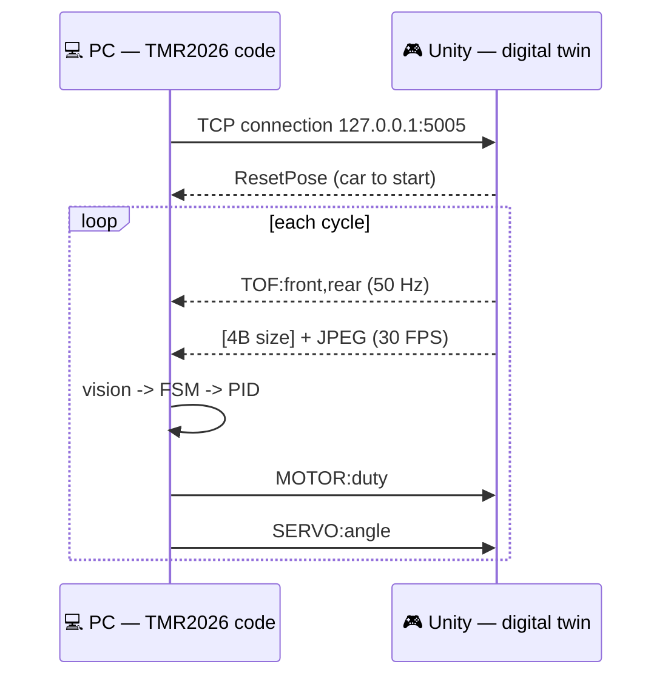
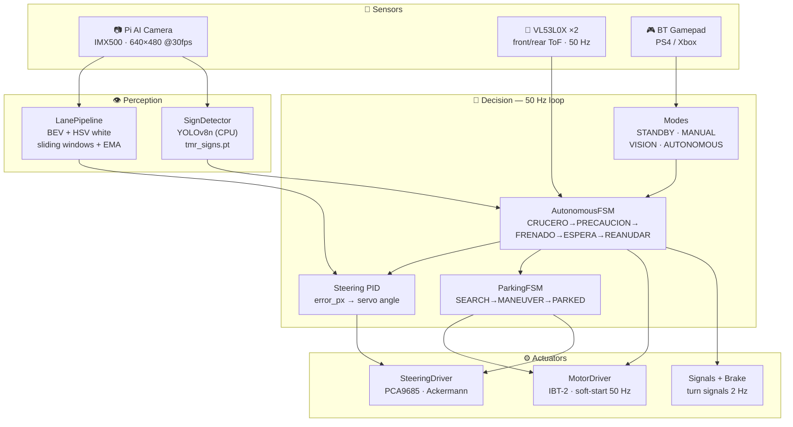
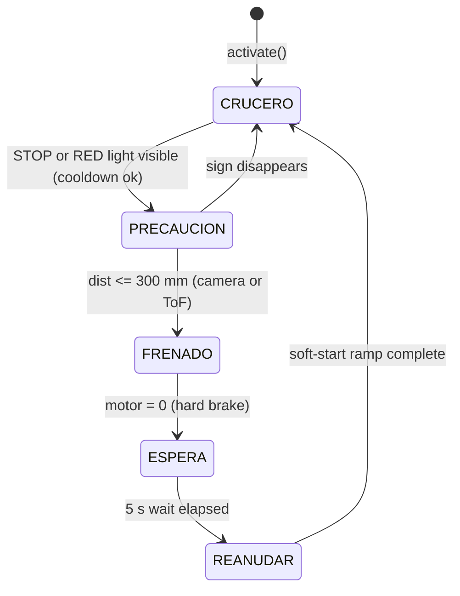
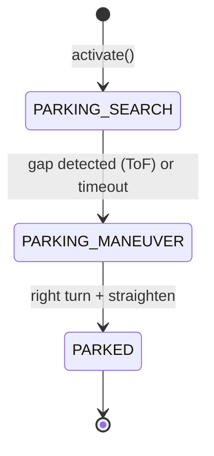

<div align="center">

# 🏎️ Sim2Real Scale Autonomous Vehicle — TMR 2026

**1:10-scale autonomous vehicle for the Mexican Robotics Tournament (TMR) 2026.**
Vision-based lane following, braking at the **STOP** sign, a driving state machine
and **battery parking** — running on a Raspberry Pi 5 with a Sony IMX500 camera.

Validated against a **Unity digital twin** (Sim2Real) before touching the hardware.

[](https://python.org)
[](https://raspberrypi.com)
[](https://opencv.org)
[](https://ultralytics.com)
[](https://github.com/Robotics-TESE/TMR2026_Sim)
[](#-sim2real-validation-digital-twin)

</div>

---

## 📑 Table of contents

- [What is it?](#-what-is-it)
- [Sim2Real validation (digital twin)](#-sim2real-validation-digital-twin)
- [System architecture](#-system-architecture)
- [State machine](#-state-machine)
- [Class diagram (UML)](#-class-diagram-uml)
- [Vision pipeline](#-vision-pipeline)
- [Hardware and pinout](#-hardware-and-pinout)
- [Repository structure](#-repository-structure)
- [Installation (Raspberry Pi)](#-installation-raspberry-pi)
- [Running](#-running)
- [Gamepad controls](#-gamepad-controls)
- [Key parameters](#-key-parameters-configpy)
- [Concurrency (threads)](#-concurrency-threads)
- [Competition checklist](#-competition-checklist)
- [Credits](#-credits)

---

## 🎯 What is it?

A scale car that drives **by itself** on a TMR track: it detects the lane with the camera,
keeps its trajectory with a **PID** controller, stops at the **STOP** sign at the regulation
distance, waits, resumes, and finally performs a **battery parking** manoeuvre.

The whole brain runs on a **Raspberry Pi 5**. The same control code is first validated against
a **Unity digital twin** (no risk of crashing the hardware) and then deployed on the physical
car — that is **Sim2Real**.

| Capability | Status | Module |
|---|---|---|
| Lane following (PID) | ✅ Production | `vision/lane_pipeline.py` + `control/pid_controller.py` |
| Sign detection (YOLO + color) | ✅ Production | `vision/sign_detector.py` — 7 classes; only **STOP/red** brake |
| Driving FSM (5 states) | ✅ Production | `control/fsm.py` |
| Battery parking | ✅ Production (Pi **and** sim, **Y** button) | `control/parking_fsm.py` |
| Turn signals + brake light | ✅ Production | `hardware/signals.py`, `hardware/brake_light.py` |
| Unity digital twin (Sim2Real) | ✅ Validated 100/100 | `main_simulator.py` + repo [TMR2026_Sim](https://github.com/Robotics-TESE/TMR2026_Sim) |
| On-camera **NPU** detection | ✅ Integrated (auto if the `.rpk` exists) | `vision/imx500_detector.py` · [guide](TMR2026/docs/IMX500_NPU.md) |
| Overtaking / crosswalk | 🧪 Available (not integrated) | `autonomy/` |

---

## 🏆 Sim2Real validation (digital twin)

Before risking the physical car, the control code (`TMR2026/`) connects over **TCP** to a 3D
replica in **Unity**. The PC sends motor/servo commands and Unity returns sensors (ToF) and
images (JPEG), exactly as the real hardware would.



**A single run** executes the full sequence and validates the 3 protocol tests:
drive → detect STOP → brake → wait 5 s → resume → drive forward → **park**.

| Test | Criterion | Result |
|---|---|---|
| **P1 — Latency** of the perception→actuation loop | mean < 200 ms | **30/30** · ~9 ms |
| **P2 — PID braking** at STOP | stop at 270 ± 30 mm without overshoot | **40/40** · 292 mm |
| **P3 — FSM transitions** without blocking | STOP cycle 5/5 + parking 3/3 | **30/30** |
| | | **🟢 100/100 — PASSED** |

> The `run_validation.py` runner generates the CSVs, the figures (`matplotlib`) and a
> `SCOREBOARD.txt` score report. See details in
> [`TMR2026/docs/DELIVERY_PROFESSOR.md`](TMR2026/docs/DELIVERY_PROFESSOR.md).

---

## 🧩 System architecture

The main loop runs at **50 Hz**. Perception and drivers live in *daemon* threads so they never
block control.



---

## 🔁 State machine

### Driving cycle (`control/fsm.py`)

5 states (the names are kept as code identifiers). The STOP wait uses `time.monotonic()`
(**never** `sleep()`), so the vision thread never freezes.



| State | What it does | Lights |
|---|---|---|
| **CRUCERO** (cruise) | Follows the lane with PID | Turn signal by angle |
| **PRECAUCION** (caution) | Detected STOP/red, reduces speed | Hazards |
| **FRENADO** (braking) | `motor.brake()` — hard cut to 0 | Hazard + brake |
| **ESPERA** (wait) | Stopped 5 s (TMR rule) | Hazard + brake |
| **REANUDAR** (resume) | Acceleration ramp + 3 s cooldown | Turn signal |

> 🚦 **Only STOP and a RED light brake the car.** Green, yellow and the arrows are detected
> and reported in telemetry, but do not interrupt driving — the exact same logic in the
> simulator and on the Pi (Sim2Real parity).

### Battery parking (`control/parking_fsm.py`)



> Gap search uses the **front ToF**; the entry manoeuvre (turn + straighten) is **open-loop,
> time-based**, like a scripted parking routine.

---

## 🧱 Class diagram (UML)


> The **simulator** replaces `CameraStream`, `MotorDriver`, `SteeringDriver` and `DistanceSensor`
> with socket-based *mocks* (`sim_hardware_mocks.py`) — the FSM, the PID and the vision are
> **identical** in the sim and on the Pi.

---

## 👁️ Vision pipeline

`vision/lane_pipeline.py` turns each frame into a lane error in pixels:

1. **BEV** (Bird's-Eye View) — perspective transform to a top-down view.
2. **HSV white mask** — isolates the lines. The threshold is **per-instance configurable**:
   - **Physical Pi** → `V >= 130` (medium-low light, e.g. a phone flashlight).
   - **Unity** → `V >= 200` (bright lines on a dark floor).
3. **Sliding windows** — follows the line strip by strip from bottom to top.
4. **EMA smoothing** + **temporal persistence** — if the dashed line disappears, it holds the
   last path for up to 1 s and rejects abrupt error jumps (anti false-turns).
5. **Right bias** (`right_bias`) — the target is placed toward the right line (TMR lane).

The resulting error feeds the steering PID. Inspect the live mask with:

```bash
python tools/test_camera.py --no-yolo   # camera + lane + PID, no motors
```

---

## 🛠️ Hardware and pinout

| Component | Model | Interface |
|---|---|---|
| Computer | Raspberry Pi 5 (16 GB) | — |
| Camera | Pi AI Camera (Sony IMX500) | CSI-2 |
| Distance sensor | VL53L0X × 2 | I²C bus 4 |
| H-bridge | IBT-2 | GPIO PWM |
| Servo controller | PCA9685 | I²C bus 3 |
| Steering servo | MG90s | PWM 50 Hz |
| Gamepad | PS4 / Xbox | Bluetooth |

<details>
<summary><b>📍 Raspberry Pi 5 pinout (BCM)</b></summary>

```
Motor (IBT-2)
  GPIO 18 -> RPWM (forward)       GPIO 13 -> LPWM (reverse)
  R_EN / L_EN -> fixed 3.3 V (always enabled)

Servo
  PCA9685 on I²C Bus 3 (SDA=GPIO 0, SCL=GPIO 1) · address 0x40

ToF (VL53L0X)
  I²C Bus 4 (SDA=GPIO 23, SCL=GPIO 22)
  Front 0x30 · Rear 0x29
  XSHUT front=GPIO 24 · rear=GPIO 27

LEDs (pins in config.py)
  Status: STOP=GPIO 25, system=GPIO 26
  Vehicle: left/right turn signal + brake -> TMR signaling
```

GPIO accessed via **`lgpio`** (chip 4 on the Pi 5) with an `RPi.GPIO` fallback.
</details>

---

## 📂 Repository structure

```
Sim2Real-Scale-Vehicle/
├── README.md                  ← this file
├── main.py                    ← loader (chdir into TMR2026/ and run)
├── docs/                      ← architecture diagram (PNG/PDF) + generator
│
└── TMR2026/                   ★ active system
    ├── main.py                ← production (Raspberry Pi) — 5 modes
    ├── main_simulator.py      ← digital twin (Unity / Sim2Real)
    ├── config.py              ← ALL parameters (single source of truth)
    │
    ├── hardware/
    │   ├── motor.py           ← IBT-2 with soft-start (ACTIVE)
    │   ├── steering_driver.py ← PCA9685 + Ackermann + STEERING_INVERTED
    │   ├── distance_sensor.py ← 2× VL53L0X @50 Hz
    │   ├── signals.py         ← turn signals / hazard (2 Hz)
    │   └── brake_light.py     ← brake light
    │
    ├── vision/
    │   ├── camera_stream.py   ← Picamera2 · RGB→BGR
    │   ├── lane_pipeline.py   ← lane: BEV + sliding windows + EMA  (ACTIVE)
    │   ├── sign_detector.py   ← YOLOv8n NCNN + color fallback      (ACTIVE)
    │   └── imx500_detector.py ← on-camera NPU detection (if .rpk present)
    │
    ├── control/
    │   ├── fsm.py             ← driving FSM (5 states)
    │   ├── parking_fsm.py     ← battery parking (Pi + sim)
    │   └── pid_controller.py  ← anti-windup PID
    │
    ├── docs/                  ← SETUP, Sim2Real protocol, calibration, deliveries
    ├── tests/                 ← pytest: FSM, signals, YOLO hysteresis
    │
    ├── sim_hardware_mocks.py  ← socket mocks (camera/motor/servo/ToF)
    ├── validation_logger.py   ← CSV + Sim2Real scoreboard
    ├── run_validation.py      ← runs the 3 tests + figures
    ├── analyze_results.py     ← article figures (matplotlib)
    │
    ├── tools/test_camera.py   ← camera+lane+YOLO preview (no motors)
    ├── tools/export_model.py  ← exports the .pt to NCNN (after retraining)
    ├── tools/export_imx500.py ← exports the .pt to the camera NPU (.rpk, on the Pi)
    ├── weights/
    │   ├── tmr_signs.pt           ← YOLO model (PyTorch, fallback)
    │   └── tmr_signs_ncnn_model/  ← NCNN export — used by the Pi (3-4× faster)
    └── systemd/               ← auto-start on boot
```

> `autonomy/`, `hardware/camera_manager.py`, `hardware/motor_driver.py`,
> `vision/lane_detector.py` and `vision/object_detector.py` are **alternative implementations**
> (on-chip NPU, overtaking FSM, etc.) kept as a library; they are **not** wired into `main.py`.

---

## 📦 Installation (Raspberry Pi)

<details>
<summary><b>1 — System dependencies</b></summary>

```bash
sudo apt update && sudo apt install -y \
  python3-picamera2 python3-libcamera imx500-all \
  python3-pygame bluetooth bluez python3-dbus python3-smbus2

pip3 install --break-system-packages \
  adafruit-circuitpython-pca9685 adafruit-circuitpython-vl53l0x \
  adafruit-extended-bus adafruit-blinka \
  opencv-python-headless lgpio ultralytics ncnn
```
</details>

<details>
<summary><b>2 — Alternative I²C buses</b> (in <code>/boot/firmware/config.txt</code>)</summary>

```
# Bus 3 -> PCA9685 (servo)
dtoverlay=i2c-gpio,bus=3,i2c_gpio_sda=0,i2c_gpio_scl=1,i2c_gpio_delay_us=2
# Bus 4 -> VL53L0X (ToF)
dtoverlay=i2c-gpio,bus=4,i2c_gpio_sda=23,i2c_gpio_scl=22,i2c_gpio_delay_us=2
```
```bash
i2cdetect -y 3   # -> 0x40 (PCA9685)
i2cdetect -y 4   # -> 0x29 and 0x30 (VL53L0X)
```
</details>

<details>
<summary><b>3 — Bluetooth gamepad and auto-start (systemd)</b></summary>

```bash
# Pair the gamepad (trusted = reconnects on its own when powered on)
bluetoothctl
  power on; agent on; scan on
  pair XX:XX:XX:XX:XX:XX; trust XX:XX:XX:XX:XX:XX; connect XX:XX:XX:XX:XX:XX

# Boot service
sudo cp TMR2026/systemd/carrito_tmr.service /etc/systemd/system/
sudo systemctl daemon-reload
sudo systemctl enable --now carrito_tmr
journalctl -u carrito_tmr -f   # live logs
```
</details>

More detail in [`TMR2026/docs/SETUP.md`](TMR2026/docs/SETUP.md).

---

## ▶️ Running

```bash
# On the Raspberry Pi (production)
python main.py                 # from the root (recommended)
python main.py --display       # with a camera window on HDMI

# If the systemd service is holding the pins:
sudo systemctl stop carrito_tmr && python main.py
```

```bash
# On the PC (digital twin — requires Unity in PLAY)
cd TMR2026
python run_validation.py       # 3 Sim2Real tests + figures + score
python main_simulator.py --display   # just watch live
```

```bash
# Unit tests (PC or Pi — no hardware, no Unity)
pytest TMR2026/tests -v
```

---

## 🎮 Gamepad controls

| Button | Action |
|---|---|
| **A / Cross** | **MANUAL** mode |
| **B / Circle** | **VISION** mode (camera ON, motors OFF) |
| **X / Square** | **AUTONOMOUS** mode (toggle) |
| **Y / Triangle** | **PARKING** mode — battery parking (toggle) |
| **Start** | **Emergency stop** (brake + MANUAL) |
| Left stick X | Steering (MANUAL) |
| Triggers R2 / L2 | Throttle / reverse (MANUAL) |

> The gamepad is **hot-plug**: if the paired PS4 is powered on after boot, it reconnects on its own.
> Without a gamepad there is also a **keyboard** fallback (in the terminal): `A`=manual · `B`=vision ·
> `X`=autonomous · `P`=parking · `Space`=emergency · `S`=standby · `Q`=quit.

---

## ⚙️ Key parameters (`config.py`)

| Group | Variable | Value |
|---|---|---|
| **Steering PID** | `STEER_KP / KI / KD` | 0.09 · 0.002 · 0.025 |
| **Speed PID** | `VEL_STOP_KP / KI / KD` | 0.035 · 0.001 · 0.008 |
| **Speeds** | straight / curve / approach | 22 % · 15 % · 10 % |
| **STOP** | brake start / target / wait | 700 mm · 270 mm · 5.0 s |
| **Emergency** | `EMERGENCY_STOP_MM` | 120 mm |
| **Servo** | center / min / max | 90° · 58° · 122° |
| **Inverted steering** | `STEERING_INVERTED` | `True` (corrected in the driver) |
| **Parking** | search / maneuver / gap | 15 % · 10 % · 600 mm |

---

## 🧵 Concurrency (threads)

```
Main loop      (50 Hz) ── gamepad → FSM → servo → motor → signals.tick()
CameraStream   (daemon) ── 30 FPS · RGB→BGR · locks AE/AWB after warm-up
SignDetector   (daemon) ── 15 Hz · YOLO NCNN (ARM CPU) · non-blocking queue
DistanceSensor (daemon) ── 50 Hz · front + rear VL53L0X
MotorDriver    (daemon) ── 50 Hz soft-start ramp (prevents voltage sag)
```

> ⚡ **Hardware-optimized model:** `SignDetector` automatically loads the **NCNN** export
> (`weights/tmr_signs_ncnn_model/`, FP16) — the runtime Ultralytics recommends for the Raspberry
> Pi. Same detections as the `.pt` (verified), 3-4× faster on the Pi 5's ARM CPU. If missing, it
> falls back to the `.pt` and ultimately to the color STOP detector. After retraining the model:
> `python tools/export_model.py`.

> 🧠 **Top tier (on-chip NPU):** the model can also run **inside the camera** — the IMX500 infers
> on its neural accelerator and the CPU stays at ~0 %. Generate the `.rpk` once on the Pi
> (`python tools/export_imx500.py`) and `main.py` detects it automatically at startup, with a
> fallback chain NPU → NCNN → `.pt` → color. Full guide:
> [`TMR2026/docs/IMX500_NPU.md`](TMR2026/docs/IMX500_NPU.md).

---

## ✅ Competition checklist

- [ ] Gamepad connected (`python TMR2026/test_gamepad.py`)
- [ ] Servo centered and with the correct range (`python TMR2026/test_servo.py`)
- [ ] Camera detects the lane in **VISION** mode (`--display`)
- [ ] STOP sign detected at a reasonable distance
- [ ] White mask well calibrated for the track lighting (`tools/test_camera.py --no-yolo`)
- [ ] LiPo 2S battery charged (> 7.4 V)
- [ ] IBT-2 pins: RPWM=18, LPWM=13, R_EN+L_EN=3.3 V
- [ ] PCA9685 on `/dev/i2c-3` (0x40), ToF on `/dev/i2c-4`

---

## 👤 Credits

Developed by **Angel Emmanuel** for the **Mexican Robotics Tournament (TMR) 2026**.

**Stack:** Python 3.11 · OpenCV · Picamera2 · Ultralytics YOLOv8 · lgpio · Adafruit CircuitPython · Unity (digital twin)
**Platform:** Raspberry Pi 5 (16 GB) + Pi AI Camera (Sony IMX500)
**Digital twin:** [TMR2026_Sim](https://github.com/Robotics-TESE/TMR2026_Sim)

<div align="center">

*Sim2Real: validated in simulation · deployed on hardware.* 🏁

</div>
