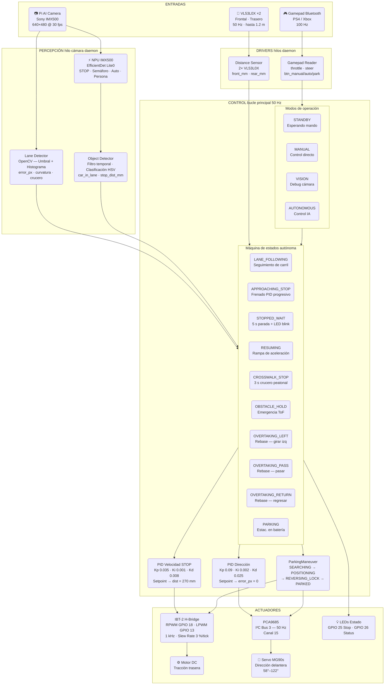
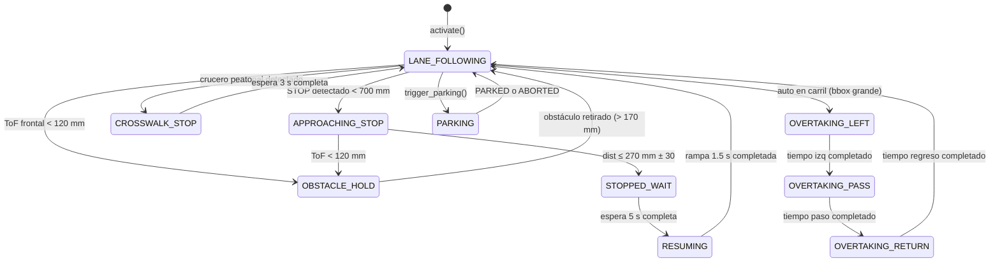

# 🏎 Carrito Autónomo — TMR 2026

> Vehículo autónomo a escala 1:10 desarrollado para el **Torneo Mexicano de Robótica 2026**.
> Basado en Raspberry Pi 5 con cámara AI (Sony IMX500), detección NPU on-chip, control PID y
> máquina de estados para seguimiento de carril, señales de tráfico, cruceros y estacionamiento
> en batería.

[](https://python.org)
[](https://raspberrypi.com)
[](LICENSE)
[](https://tmr.org.mx)

---

## Diagrama de Bloques del Sistema



---

## Diagrama de Estados Autónomos



---

## Hardware

### Componentes principales

| Componente | Modelo | Interfaz | Uso |
|---|---|---|---|
| Computador | Raspberry Pi 5 (4 GB) | — | Procesamiento principal |
| Cámara | Pi AI Camera (Sony IMX500) | CSI-2 | Visión + inferencia NPU |
| Sensor distancia | VL53L0X × 2 | I²C bus 4 (GPIO 22/23) | Distancia frontal y trasera |
| Puente H | IBT-2 | GPIO PWM | Control de motor DC |
| Controlador servo | PCA9685 | I²C bus 3 (GPIO 0/1) | PWM para servo de dirección |
| Servo dirección | MG90s | PWM 50 Hz | Giro ruedas delanteras |
| Mando | PS4 / Xbox genérico | Bluetooth | Control manual y cambio de modo |

### Pinout Raspberry Pi 5

```
GPIO 18  (Pin 12) ──→ IBT-2 RPWM  (avance)
GPIO 13  (Pin 33) ──→ IBT-2 LPWM  (reversa)
GPIO 25  (Pin 22) ──→ LED Rojo    (estado STOP)
GPIO 26  (Pin 37) ──→ LED Verde   (estado sistema)

GPIO 17  (Pin 11) ──→ VL53L0X XSHUT frontal
GPIO 27  (Pin 13) ──→ VL53L0X XSHUT trasero

I²C Bus 3  SDA=GPIO 0  (Pin 27)  ──┐
           SCL=GPIO 1  (Pin 28)  ──┘── PCA9685 (0x40) → Servo canal 15

I²C Bus 4  SDA=GPIO 23 (Pin 16)  ──┐
           SCL=GPIO 22 (Pin 15)  ──┘── VL53L0X frontal (0x30) + trasero (0x29)
```

> **R_EN y L_EN del IBT-2** conectados a 3.3 V fijo (sin GPIO de enable).

---

## Instalación

### 1 — Dependencias del sistema

```bash
sudo apt update && sudo apt install -y \
  python3-picamera2 python3-libcamera imx500-all \
  python3-pygame \
  bluetooth bluez python3-dbus \
  python3-smbus2

pip3 install --break-system-packages \
  adafruit-circuitpython-pca9685 \
  adafruit-circuitpython-motor \
  adafruit-circuitpython-vl53l0x \
  adafruit-extended-bus \
  adafruit-blinka \
  opencv-python-headless \
  lgpio
```

### 2 — Habilitar buses I²C alternativos

Agregar al final de `/boot/firmware/config.txt`:

```
# I²C Bus 3 → PCA9685 (servo)
dtoverlay=i2c-gpio,bus=3,i2c_gpio_sda=0,i2c_gpio_scl=1,i2c_gpio_delay_us=2

# I²C Bus 4 → VL53L0X (ToF)
dtoverlay=i2c-gpio,bus=4,i2c_gpio_sda=23,i2c_gpio_scl=22,i2c_gpio_delay_us=2
```

Reiniciar y verificar:
```bash
ls /dev/i2c-*    # deben aparecer /dev/i2c-3 y /dev/i2c-4
i2cdetect -y 3   # → 0x40 (PCA9685)
i2cdetect -y 4   # → 0x29 y 0x30 (VL53L0X)
```

### 3 — Clonar y entrar al directorio

```bash
git clone https://github.com/TU_USUARIO/Carrito.git
cd Carrito/TMR2026
```

### 4 — Conectar el mando Bluetooth

```bash
bluetoothctl
  power on
  agent on
  scan on
  # Poner mando en modo pairing (PS/Xbox + Share)
  pair   XX:XX:XX:XX:XX:XX
  trust  XX:XX:XX:XX:XX:XX
  connect XX:XX:XX:XX:XX:XX
  quit
```

El mando guardado como *trusted* se reconecta automáticamente al encender la Pi.

### 5 — Arranque automático (servicio systemd)

```bash
# Editar la ruta en el archivo si es necesario
sudo cp systemd/carrito_tmr.service /etc/systemd/system/
sudo systemctl daemon-reload
sudo systemctl enable carrito_tmr
sudo systemctl start  carrito_tmr

# Ver logs en vivo
journalctl -u carrito_tmr -f
```

---

## Ejecución

```bash
# Modo normal (sin pantalla — SSH)
cd Carrito/TMR2026
python3 main.py

# Con ventana de cámara en HDMI de la Pi
python3 main.py --display

# Detener el servicio para ejecutar manualmente
sudo systemctl stop carrito_tmr
python3 main.py
```

---

## Controles del mando

| Botón | Acción |
|---|---|
| **Cruz / A** | Modo Manual |
| **Círculo / B** | Modo Visión (cámara ON, motores OFF) — presionar de nuevo vuelve a Manual |
| **Cuadrado / X** | **Modo Autónomo** (toggle — presionar de nuevo desactiva) |
| **Triángulo / Y** | Iniciar maniobra de **Estacionamiento en batería** |
| **Palanca izq. X** | Dirección (modo Manual) |
| **Gatillo R2** | Acelerador (modo Manual, máx 50 %) |
| **Gatillo L2** | Reversa suave (modo Manual, máx 30 %) |

---

## Configuración clave

Todos los parámetros están centralizados en **`TMR2026/config.py`**.

### Velocidades autónomas

| Variable | Valor | Descripción |
|---|---|---|
| `SPEED_STRAIGHT` | 22 % | Velocidad en rectas |
| `SPEED_CURVE` | 15 % | Velocidad en curvas |
| `SPEED_APPROACH` | 10 % | Velocidad al aproximar señal STOP |
| `PARK_SEARCH_SPEED` | 15 % | Velocidad durante búsqueda de espacio |
| `PARK_MANEUVER_SPEED` | 10 % | Velocidad durante maniobra de parking |

> Subir de **5 en 5** hasta que el coche avance bien en pista. No bajar de 10 % para evitar que el motor se trabe.

### Señal STOP

| Variable | Valor | Descripción |
|---|---|---|
| `STOP_BRAKE_START_MM` | 700 mm | Empieza el frenado progresivo |
| `STOP_TARGET_MM` | 270 mm | Distancia final de parada (≤ 30 cm regla TMR) |
| `STOP_WAIT_SEC` | 5.0 s | Pausa obligatoria frente al STOP |
| `EMERGENCY_STOP_MM` | 120 mm | Freno de emergencia por obstáculo |

### Ganancias PID

| PID | Kp | Ki | Kd |
|---|---|---|---|
| Dirección | 0.09 | 0.002 | 0.025 |
| Velocidad STOP | 0.035 | 0.001 | 0.008 |

---

## Guía de calibración en pista

| Parámetro | Dónde | Cómo ajustar |
|---|---|---|
| `STEER_KP` | config.py | Aumentar hasta que oscile → dividir entre 2 |
| `SPEED_STRAIGHT` | config.py | Subir de 5 en 5 hasta velocidad competitiva |
| `threshold` en LaneDetector | vision/lane_detector.py | Ajustar (160–200) según iluminación de la pista |
| `CAMERA_FOCAL_LENGTH_PX` | config.py | Medir señal STOP a 30 cm y ajustar hasta que `stop_dist_mm ≈ 300` |
| `PARK_OVERSHOOT_SEC` | config.py | Cronometrar cuánto tarda en pasar 30 cm a `PARK_SEARCH_SPEED` |
| `PARK_REVERSE_LOCK_SEC` | config.py | Ajustar hasta que la reversa describa ~90° de arco |

### Verificar sensores antes de competir

```bash
cd Carrito/TMR2026
# 1. Probar servo
python3 test_servo.py

# 2. Probar mando
python3 test_gamepad.py

# 3. Ver cámara + carril en modo VISION
python3 main.py --display
# → presionar Círculo en el mando
```

---

## Estructura del repositorio

```
Carrito/
│
├── README.md                         ← Este archivo
│
├── TMR2026/                          ← Sistema principal (TMR 2026) ★
│   ├── main.py                       ← Punto de entrada · FSM de modos
│   ├── config.py                     ← Todos los parámetros del sistema
│   ├── requirements.txt
│   ├── SETUP.md                      ← Guía de instalación detallada
│   │
│   ├── hardware/
│   │   ├── motor_driver.py           ← IBT-2 vía lgpio + slew rate anti-inrush
│   │   ├── steering_driver.py        ← PCA9685 + geometría Ackermann
│   │   ├── distance_sensor.py        ← 2× VL53L0X (opcional, graceful degradation)
│   │   └── camera_manager.py         ← Picamera2 + IMX500 NPU hilo dedicado
│   │
│   ├── control/
│   │   ├── pid_controller.py         ← PID discreto con anti-windup
│   │   └── gamepad_reader.py         ← Joystick Bluetooth hilo dedicado
│   │
│   ├── vision/
│   │   ├── lane_detector.py          ← Carril: error_px · curvatura · crucero
│   │   └── object_detector.py        ← STOP · semáforo · auto · persona
│   │
│   ├── autonomy/
│   │   ├── autonomous_mode.py        ← FSM autónoma 8 estados + rebase
│   │   └── parking_maneuver.py       ← Sub-FSM estacionamiento en batería
│   │
│   ├── systemd/
│   │   └── carrito_tmr.service       ← Auto-arranque en boot (systemd)
│   │
│   ├── test_servo.py                 ← Diagnóstico de servo
│   └── test_gamepad.py               ← Diagnóstico de mando
│
├── AUTO_YOLO/                        ← Sistema original (USB webcam + I²C ToF)
│   └── main.py                       ← Punto de entrada legado
│
└── CAMARA/ · CONTROL/ · STATE_MACHINE/   ← Módulos del sistema refactorizado
```

---

## Arquitectura de hilos

```
Main thread (50 Hz)
  ├── Lee estado del gamepad, ToF, cámara
  ├── Ejecuta FSM de modos (STANDBY / MANUAL / VISION / AUTONOMOUS)
  └── Llama a AutonomousController.update() en modo AUTONOMOUS

Camera thread (daemon)
  └── Picamera2 capture_request() → NPU tensors → CameraFrame queue

ToF thread (daemon)
  └── VL53L0X.range @ 50 Hz → distance_mm actualizado con lock

Gamepad thread (daemon)
  └── pygame event pump @ 100 Hz → GamepadState + detección de flancos
```

---

## Competencia — checklist rápido

- [ ] Mando conectado por Bluetooth y reconocido en `test_gamepad.py`
- [ ] Servo centrado y rango correcto en `test_servo.py`
- [ ] Cámara detecta las líneas del carril en modo **VISION**
- [ ] Señal STOP detectada en modo **VISION** a distancia razonable
- [ ] Batería cargada y voltaje > 7.4 V (LiPo 2S)
- [ ] Pines IBT-2 conectados: RPWM=GPIO18, LPWM=GPIO13, R_EN+L_EN=3.3 V
- [ ] PCA9685 en `/dev/i2c-3`, dirección `0x40`

---

## Créditos

Desarrollado por **Angel Emmanuel** para el Torneo Mexicano de Robótica 2026.

Hardware de tracción: IBT-2 + Motor DC escala 1:10  
Plataforma: Raspberry Pi 5 + Pi AI Camera (IMX500)  
Stack de software: Python 3.11 · OpenCV · Picamera2 · lgpio · Adafruit CircuitPython
